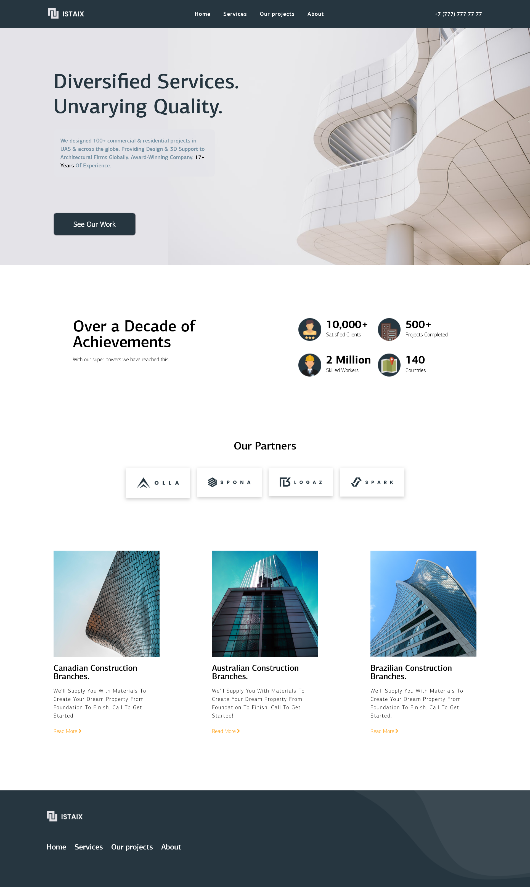
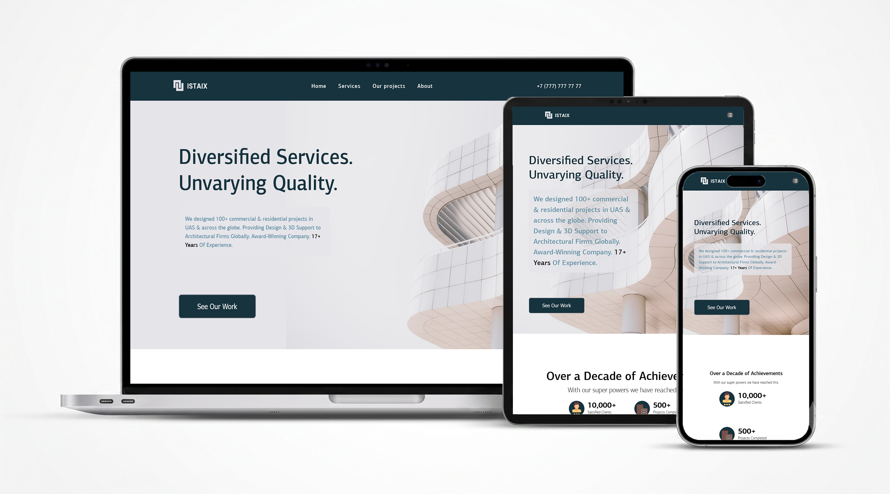

# Лендинг строительной компании

**Главная страница** 

## 👀 Посмотреть сайт
**[Открыть демо](https://vrust00.github.io/Construction-Company-Design/)**

## Что за проект
Вёрстка адаптивного лендинга для строительной компании по бесплатному макету из Figma.  
На странице есть шапка, блок с услугами, примеры проектов, форма обратной связи и контакты.

## Какие технологии использовал
- HTML5
- CSS3 (Flexbox, Grid)
- Figma
- JavaScript (меню-бургер, плавная прокрутка)

## Что получилось
- Корректно выглядит на телефонах, планшетах и больших экранах
- Семантическая разметка
- Придерживался методологии БЭМ в названиях классов
- Все ссылки и меню работают — можно проверить в [демке](https://vrust00.github.io/Construction-Company-Design/)

**Как выглядит на разных устройствах**  

## Как запустить у себя
1. Склонируйте репозиторий (cmd):  
   `git clone https://github.com/vrust00/Construction-Company-Design.git`
2. Откройте файл `index.html` в любом браузере.

## Контакты для связи со мной
- Telegram: [@j_mkll](https://t.me/j_mkll)
